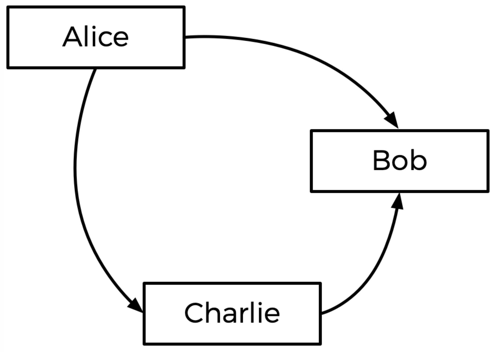

# README

The Tideman (or "ranked pairs) electoral system is unique in that it doesn't neccesarily afford victory to the candidate with the majority of votes. Instead of pitting each candidate against the entire candidate pool it places all individual candidates in one-on-one matchups with all other individual candidates.

In this system the winning candidate may not have the majority of first-choice votes, but when considering each voter's ranked choices they are the most preferred candidate over any other individual in the election.

The outcome of a Tideman election is determined by:

1. Tallying each voter's candidate rankings
2. Pitting each candidate against each other candidate, and noting who is preferred in matchup
3. Ranking each matchup by greatest to least margin of victory
4. Locking in edges in a Tideman graph

A Tideman graph determines which candidate is most preferred by voters in a head-to-head matchup. Arrows are drawn from the most-preferred to least-preferred candidate in each pairing. In the below example Alice is the election winner even if she didn't carry the most first-choice votes.

One potential pitfall of a Tideman election is the creation of a cycle where Candidate A is preferred over Candidate B who is preferred over Candidate C who is preferred over Candidate A. In this scenario a winner cannot be identified. To overcome this hurdle the arrows (or edges) of the graph are locked in based on the strength of the victory. This is done sequentially as long as locking in an edge does NOT create a cycle.

## CODE WALKTHROUGH

*tideman.c* takes between two and nine candidate names as arguments. Upon execution the module queries the user for the number of voters in the election. The function handles errors behind the scenes and will throw errors if less than two or more than nine candidates are included as parameters or if a non-integer is entered for the number voters.

The user is then prompted for each voter's ranked candidate choices. If the user enters the name of a person who is not running, an error is thrown and the user is reprompted to enter a candidate's name for that particular rank. A number of helper functions than use this data to determine the election winner.

**vote()** records each voter's candidate preferences in the ranks array. **record_preferences()** then uses each voter's ranks array to tally how many times one candidate is preferred over another.

**add_pairs()** then places each candidate in a head-to-head matchup to determine which candidate would win and which would lose if only running against each other. **sort_pairs()** then ranks all candidate matchups in decreasing order by strength of victory. For example, if Candidate A beat Candidate B by a wider margin than Candidate A beat Candidate C then the A-B pairing would rank higher than the A-C pairing. This informaiton is then used to determine the edges in the candidate graph.

**cycle_check()** uses recursion to make sure that any candidate with an arrow pointing at them does not point back to the same candidate or to any other candidate in an "edge chain" that points to them. If a cycle is not created by adding the edge, then **lock_pairs()** locks in that edge. This avoids the creation of a cycle in the graph. 

Finally, **print_winner()** iterates through each candidate matchup and to find the candidate who is locked in over every other candidate, and prints this person's name to the console.

### EXAMPLE INPUT

./tideman Mark Ben Alex  
Number of voters: 3  
VOTER 1  
Rank 1: Mark  
Rank 2: Ben  
  
VOTER 2  
Rank 1: Ben  
Rank 2: Mark  
  
VOTER 3  
Rank 1: Mark  
Rank 2: Ben  
  
### EXAMPLE OUTPUT
  
The election winner is Mark!
